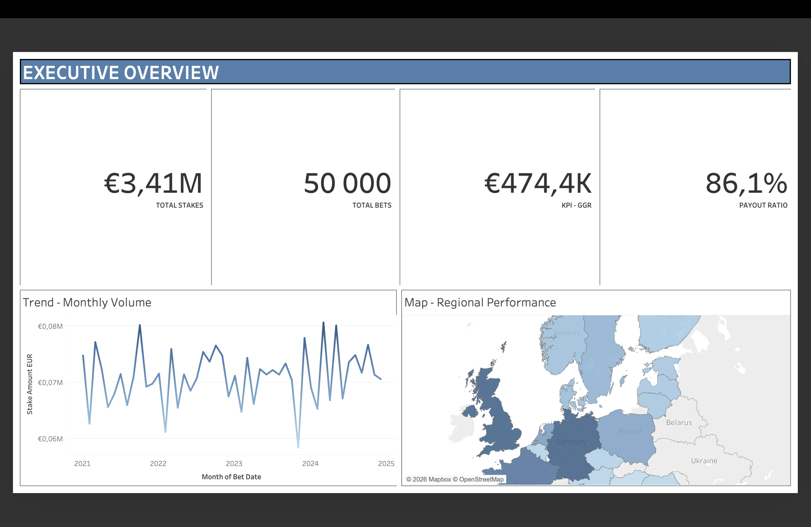
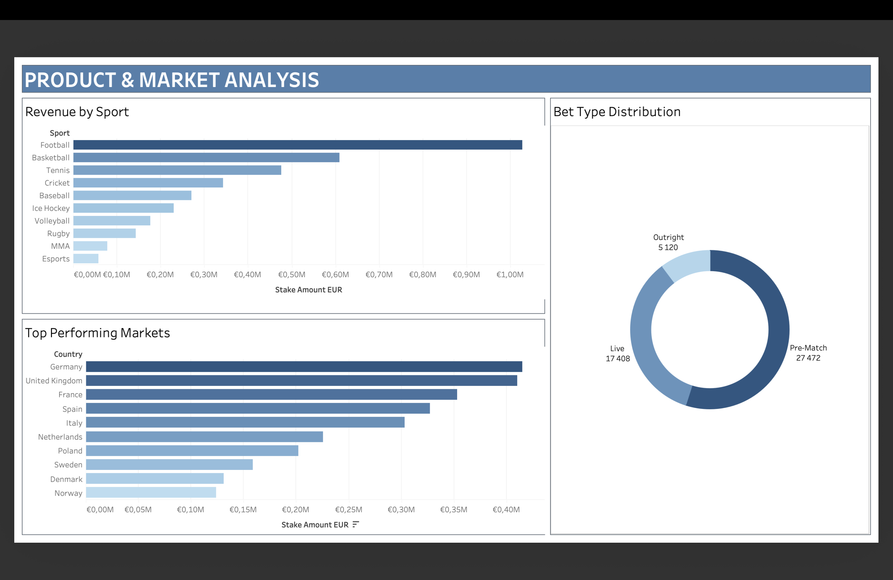
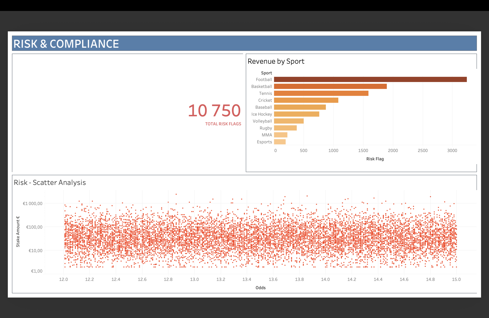

# Risk & Revenue Intelligence Suite
**End-to-End Operational Oversight & Data Quality Management**

## 📌 Project Overview
This project features a comprehensive operational intelligence suite designed to monitor market growth and mitigate risk across 20 European markets using a dataset of 50,000+ transactions. 

The core objective was to demonstrate **Data Stewardship** principles by ensuring source-to-target data integrity, maintaining technical metadata, and performing Root Cause Analysis (RCA) on financial discrepancies within a regulated environment.

## 📊 Dashboard Insights

### 1. EXECUTIVE OVERVIEW
*Focus: Strategic KPIs & Data Integrity*
* **Purpose:** Provides a high-level "Source of Truth" for total stakes (€3.41M), GGR (€474.4K), and Payout Ratios (86.1%).
* **Stewardship Focus:** Ensures data consistency across regional reporting and monthly volume trends to detect unexpected data gaps.

### 2. PRODUCT & MARKET ANALYSIS
*Focus: Metadata Mapping & Product Performance*
* **Purpose:** Granular breakdown of revenue by sport category and top-performing markets (Germany, UK, France).
* **Stewardship Focus:** Manages Data Glossary items by aligning technical sport IDs with business-facing product labels.

### 3. RISK & COMPLIANCE
*Focus: Root Cause Analysis (RCA) & Risk Mitigation*
* **Purpose:** Deep dive into "Stake vs. Odds" scatter plots and payout anomalies to detect high-risk betting patterns.
* **Stewardship Focus:** Implements Data Quality (DQ) rules to flag outliers and perform RCA on high-risk thresholds.

## 🛠 Tech Stack & Stewardship Skills
* **Tool:** Tableau Desktop (Workbook included as `.twbx`)
* **Technical Skills:** SQL Data Profiling, Metadata Alignment, Data Lineage Tracking.
* **Domain Expertise:** Fintech, Risk Operations, and Regulatory reporting (ISO 20022 alignment).

## 📂 Included Files
* `Global_Betting_Risk_and_Performance_Monitor.twbx`: Full interactive Tableau workbook.
* `Strategic_Operations_&_Risk_Intelligence_Report.pdf`: Deep-dive professional insights report.
* `Global_Betting_Risk_and_Performance_Monitor.pptx`: Presentation of key findings.

---
**Author:** Mukunthan Balu  
*M.Sc. Computer Systems*
